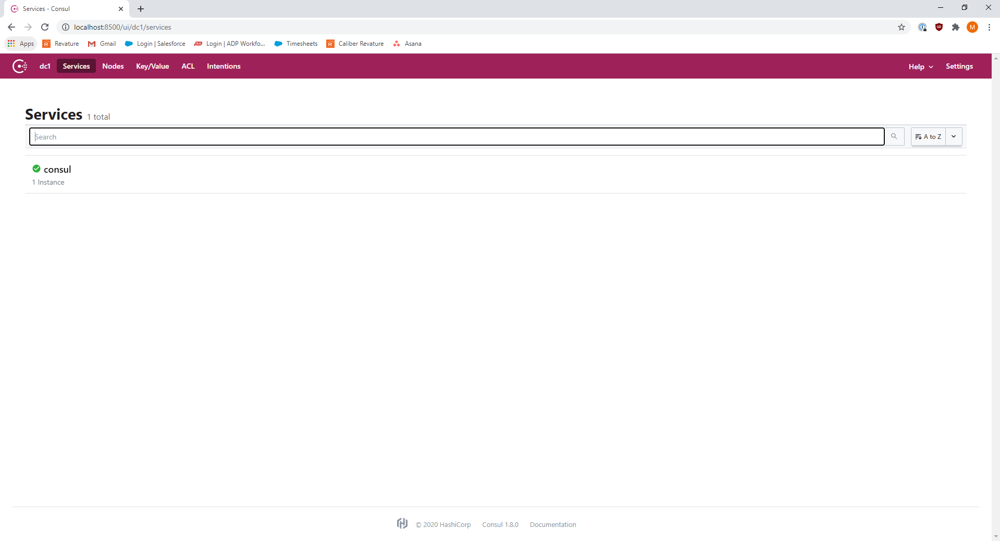

# Monolith To Distributed Tech Talk
Example for Monolith to Distributed Microservices Series Tech Talk

## Purpose

This tech talk will cover converting a basic monolithic Spring Boot application into a microservices application. It will then address common issues faced by microservice applications by leveraging the [Spring Cloud Netflix Stack](https://spring.io/projects/spring-cloud-netflix) with some upgrades. We will be using [Consul](https://www.consul.io) instead of Eureka, and [Spring Cloud Gateway](https://spring.io/projects/spring-cloud-gateway) instead of Zuul. The monolithic version of the application will be provided as a starting point.

### Getting Started: Prerequisites

* You will need [JDK 8](https://www.oracle.com/java/technologies/javase/javase-jdk8-downloads.html) installed

* You will need to have an IDE, we recommend [Spring Tool Suite](https://spring.io/tools)

* You will need to download Consul from [here](https://www.consul.io) for your platform
  * Extract the downloaded zip archive and run it
  * This will start a local consul agent at `localhost:8500`
  * You can confirm it is working by navigating to [localhost:8500/ui](http://localhost:8500/ui)



* Obtain the starting application by cloning this repository
  ```bash
  git clone https://github.com/revaturelabs/microservices-series-example.git
  ```
  * The `quiz-app` project is the initial monolith project
  * Import the projects into a workspace for your IDE

* For ease of developing model classes, we use [Lombok](https://projectlombok.org/download)

Note: All Lombok annotations can be replaced with auto-generated code snippets

The downloaded executable must be applied to the IDE in use, just direct it to the Spring Tool Suite installation directory, and can be applied to multiple IDEs at once, such as shown below.


Then make sure to restart the IDE for Lombok to be successfully applied.
